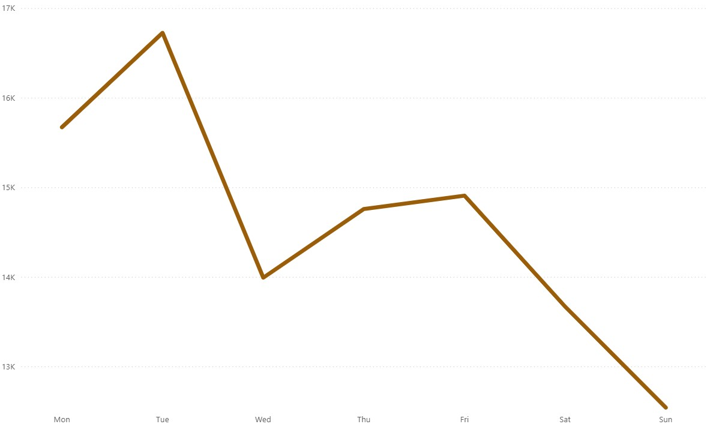
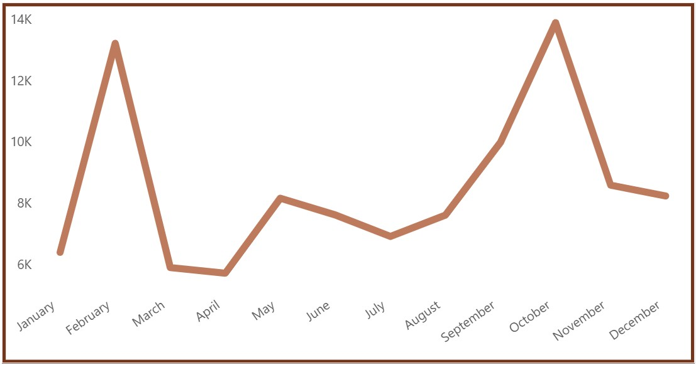
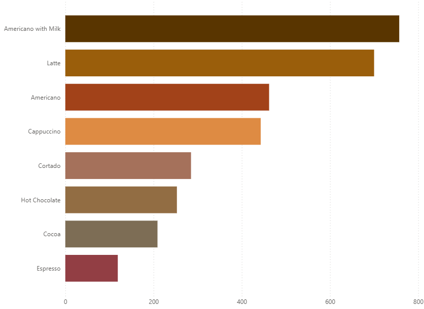
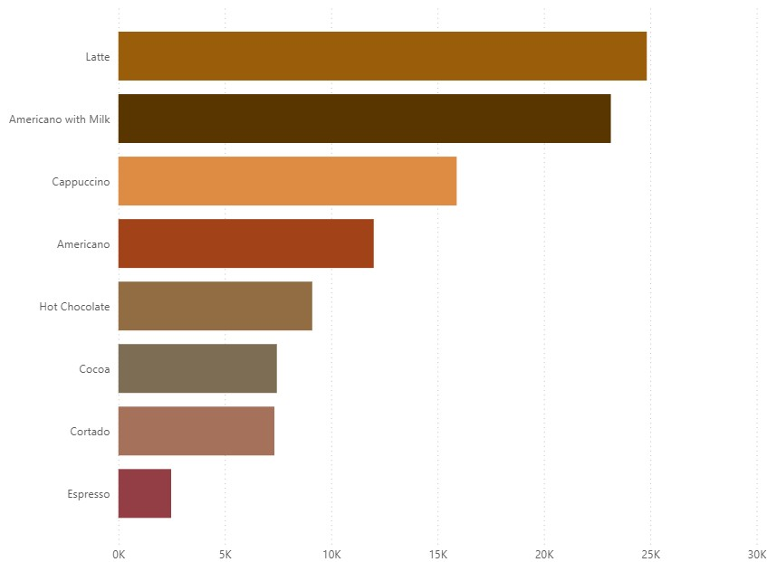

# Coffee Sales - Exploratory Data Analysis

## Table of Contents

- [Project Summary](#project-summary)
- [Data Sources](#data-sources)
- [Tools](#tools)
- [Data Cleaning/Preparation](#data-cleaningpreparation)
- [Exploratory Data Analysis](#exploratory-data-analysis)
- [Results of EDA](#results-of-eda)
- [Reccomendations](#reccomendations)
- [Limitations](#limitations)

### Project Summary

This EDA provides visualization of the sales performance this Coffee Shop's had for one year. By analyzing the sales data I am going to identify top selling products, peak sale times and identify sales trends. Using this data to make data-driven recoomendations and to predict future performance and profits. 

### Data Sources
Coffee Sales Data: The primary dataset used for this EDA is the "Coffe_sales.csv" file from Kaggle. 

### Tools

- Excel (Data Cleaning)
- SQL Server (Data Analysis)
- PowerBI (Creating Visuals)

### Data Cleaning/Preparation
During the first step of data cleaning and preperation I performed the following tasks:
- Downloading the data and inspecting the contents for errors
- Checking for duplicates, missing values, and time/date mismatches.
- Cleaning and formatting the data for analysis

### Exploratory Data Analysis

Exploring the sales data to answer these key business questions:

- Which coffee types are top sellers?
- When are the peak sales periods? (Weekly, Monthly)
- Which coffee types made the most profit?

### Results of EDA

The EDA results are summarized as follows:
1. The weekly sales data show's that during the week the busiest days are Monday's and Tuesday's, the slowest days are Saturday's and Sundays.

3. The yearly sales data show's that the busiest months are Febraury & October, the least profitable months being March and April.

 
4. The top selling products in terms of quantity sold (in order) are the Americano with Milk, Latte and Americano (without milk).

 
5. the most profitable products in terms of total revenue (in order) are the Latte, Americano with milk and Cappucino
 

### Reccomendations

Based on the EDA I reccomend the following actions:
1. Invest in marketing and promotions during peak sales periods (February & October) 
2. Focus on expanding and promoting top sellers - flavored Americanos, Cappucinos and Lattes. 
3. creating a customer loyalty program to encourage returning customers (especially during slower periods) 

### Limitations

I had to remove 1 month of data to keep the data consistent with analyzing 1 whole year of data. If the month was not removed it would have skewed my data findings as 1 month would have had 2 years of data. 
